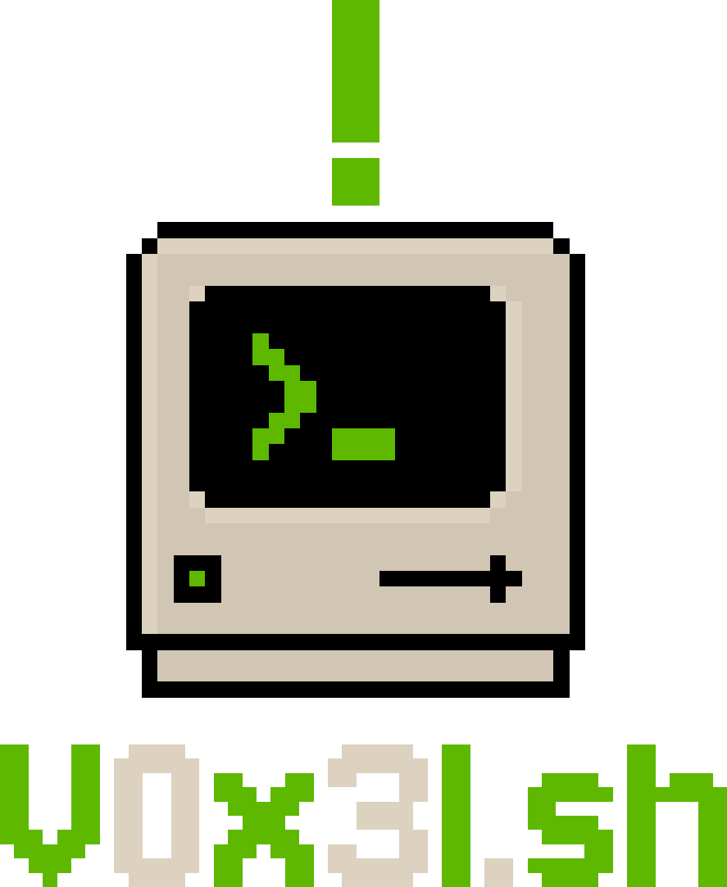

<p align="center">
  
</p>

<p align="center">
  <b>V0x3l</b> — Post-instalador modular para Ubuntu Server 26.04+ con interfaz TUI (urwid).
</p>

<p align="center">
  Automatiza toda la configuración posterior a la instalación: kernel XanMod Edge, drivers NVIDIA 595-open con soporte Optimus, Wayland + Nautilus + PipeWire, Flatpak con Flathub, TLP para optimización energética, Plymouth con tema propio, GRUB Vimix, Oh My Zsh con agnoster, LazyVim, firewall UFW, y gestor de escritorio Noctalia Shell + Hyprland.
</p>

<p align="center">
  
  
  
</p>

<p align="center"><i>Tu sistema. Tus reglas. Tu forja.</i></p>

---

## Instalación

```bash
curl -fsSL https://raw.githubusercontent.com/alexandrpunk/V0x3l/development/install.sh | bash
```

## Requisitos

- Ubuntu Server 26.04 LTS o superior
- Acceso root (sudo)
- Conexión a internet

## Características

- **Interfaz TUI**: urwid con split panel (pasos a la izquierda, output en vivo a la derecha)
- **6 secciones modulares**: Preparación, Rendimiento, Software, Configuración, Apariencia, Entorno
- **Checkpoint reanudable**: continúa desde donde quedó si falla
- **Monitor de paquetes**: barra de progreso, velocidad, contador durante instalaciones
- **Navegación**: teclas 1-6 para acciones directas, flechas para navegar
- **.env configurable**: nombre del proyecto, versión, rutas, repositorio desde archivo central

## Uso

```bash
# Desde el repo clonado
sudo python3 -m v0x3l

# Demo de la interfaz (no modifica el sistema)
python3 demo_ui.py
```

## Secciones

| # | Sección | Descripción |
|---|---------|-------------|
| 0 | Preparación del sistema | herramientas base, repos, locale, zona horaria |
| 1 | Rendimiento y drivers | kernel XanMod Edge + GPU NVIDIA |
| 2 | Software | Wayland, Nautilus, PipeWire, Flatpak, Zsh, LazyVim |
| 3 | Configuración | Polkit, UFW, red, servicios, TLP |
| 4 | Apariencia | Colloid icons, Plymouth, GRUB Vimix |
| 5 | Entorno | Gestor de escritorio Noctalia Shell + Hyprland |

## Recursos

Recursos utilizados:

| Proyecto | Enlace |
|----------|--------|
| GRUB Vimix | https://github.com/vinceliuice/vimix-grub2-theme |

## Versiones

- `main` — versiones estables
- `development` — desarrollo activo

## Licencia

GPL-3.0

---

**> sudo make it yours**
