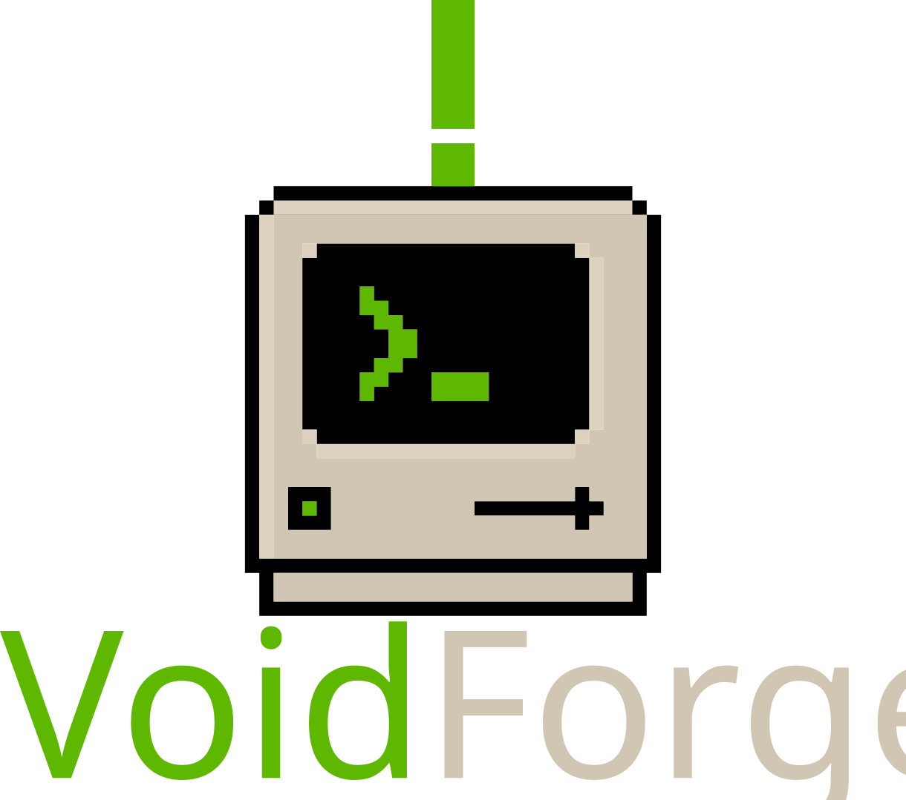

<p align="center">
  
</p>

<p align="center">
  <b>Tu sistema. Tus reglas. Tu forja.</b>
</p>

<p align="center">
  
  
  
</p>

---

# VoidForge

Post-instalador modular para Ubuntu Server 24.04+. Automatiza la configuración completa: kernel XanMod, drivers NVIDIA/Optimus, Wayland, Nautilus, PipeWire, Flatpak, TLP, Plymouth, GRUB, y más.

## Una línea

```bash
bash <(curl -fsSL https://raw.githubusercontent.com/alexandrpunk/VoidForge/main/install.sh)
```

## Requisitos

- Ubuntu Server 24.04 LTS o superior
- Acceso root (sudo)
- Conexión a internet
- 20GB espacio libre en disco

## Características

- **16 pasos modulares** — cada paso es un archivo independiente en `install/<categoria>/`
- **Checkpoint system** — guarda progreso en `/tmp/voidforge-progress`, reanudable tras fallos
- **Menú interactivo** con `gum` (fallback texto si no está disponible)
- **CLI flags**: `--resume`, `--step N`, `--range N-M`, `--skip N,M,...`, `--all`
- **Detección de hardware**: GPU NVIDIA, sistemas híbridos Intel+NVIDIA
- **Idempotente**: configuraciones existentes se omiten, se puede re-ejecutar sin riesgo
- **Salida en vivo**: `nala` muestra progreso y velocidad de descarga en tiempo real
- **Sin prompts**: `DEBIAN_FRONTEND=noninteractive` + `NEEDRESTART_MODE=a`

## Uso

```bash
# Menú interactivo
sudo bash voidforge.sh

# Flags CLI
sudo bash voidforge.sh --step 5           # Solo paso 5
sudo bash voidforge.sh --range 5-10       # Pasos 5 a 10
sudo bash voidforge.sh --resume           # Reanudar desde checkpoint
sudo bash voidforge.sh --skip 3,7         # Omitir pasos 3 y 7
sudo bash voidforge.sh --all              # Todos los pasos

# One-liner (clona repo y ejecuta)
bash <(curl -fsSL https://raw.githubusercontent.com/alexandrpunk/VoidForge/main/install.sh)
```

## Pasos

| # | Categoría | Descripción |
|---|-----------|-------------|
| 0 | core | `nala`, `git`, `curl`, `zsh`, `pciutils`, `locales` |
| 1 | core | ButterRepo, PPAs Dank Linux, upgrade, timezone, locale, grupos |
| 2 | hardware | Kernel XanMod Edge x64v3 + dkms + clang/lld |
| 3 | hardware | NVIDIA 595-open + prime + on-demand + servicios suspend/resume |
| 4 | packages | Wayland, Nautilus, PipeWire, bluez, neovim, tmux, fastfetch, codecs, TLP, Flatpak, fonts (todo en 1 sola instalación nala) |
| 5 | system | Polkit automount para grupo plugdev |
| 6 | system | xdg-user-dirs + UFW deny incoming, allow SSH |
| 7 | system | Netplan → NetworkManager + desactivación systemd-networkd-wait-online |
| 8 | packages | Flathub + apps Flatpak (Papers, Resources, Showtime) |
| 9 | system | Servicios: udisks2, bluetooth, NetworkManager, pipewire, wireplumber + entorno Wayland |
| 10 | system | TLP (CPU 80% en batería, PCIe powersupersave, USB autosuspend) + logind |
| 11 | packages | Oh My Zsh + tema agnoster, chsh a zsh |
| 12 | packages | LazyVim (Neovim config) |
| 13 | theming | Colloid icon theme catppuccin green |
| 14 | theming | Plymouth (desde assets/) + GRUB Vimix + parámetros kernel NVIDIA + limpieza nala |
| 15 | final | DMS (Dank Linux) vía `install.danklinux.com` |

## Estructura del proyecto

```
VoidForge/
├── install.sh              # Entry point curl|bash — clona repo → ejecuta voidforge.sh
├── voidforge.sh            # Runner principal — menú + CLI + dispatch de steps
├── ascii.sh                # Banner ASCII art
├── lib/
│   ├── config.sh           # Variables globales
│   ├── helpers.sh          # Funciones: root(), run_cmd(), log_*, checkpoint, spinner
│   └── gum.sh              # Gum wrappers (spin, choose, confirm) con fallback texto
├── install/
│   ├── core/               # steps 0-1: bootstrap + repos
│   ├── drivers/            # steps 2-3: kernel + GPU
│   ├── packages/           # steps 4,8,11,12: software
│   ├── system/             # steps 5,6,7,9,10: configuración del sistema
│   ├── theming/            # steps 13-14: iconos + Plymouth/GRUB
│   └── final/              # step 15: DMS
├── assets/
│   └── themes/
│       └── voidforge-boot-theme/   # Tema Plymouth pre-extraído
├── voidforge-logo.svg      # Logo vectorial
├── voidforge-logo.png      # Logo rasterizado
├── AGENTS.md               # Notas para desarrollo
└── README.md               # Este archivo
```

## Hardware

### GPU NVIDIA

- **GPU NVIDIA pura** → `nvidia-driver-595-open` + servicios suspend/resume
- **GPU híbrida (Intel + NVIDIA)** → `nvidia-driver-595-open` + `nvidia-prime` + `prime-select on-demand`
- **Sin NVIDIA** → usa Mesa (Mesa-DRI incluido en step 4)

Parámetros kernel agregados automáticamente:

```
nvidia-drm.modeset=1 nvidia-drm.fbdev=1 nvidia.NVreg_PreserveVideoMemoryAllocations=1
```

Módulos en initramfs (si GPU NVIDIA):

```
nvidia nvidia-drm nvidia-modeset nvidia-uvm
```

### Laptops

TLP configurado con:
- CPU limitado a 80% en batería
- PCIe ASPM powersupersave
- USB autosuspend
- WiFi power save en batería
- Audio power save

## Personalización

### Zona horaria y locale

Por defecto: `America/Mazatlan` + `es_MX.UTF-8`

Editar en `install/core/system-prep.sh`:

```bash
root timedatectl set-timezone tu-zona
```

### Tema Plymouth

El tema está incluido en `assets/themes/voidforge-boot-theme/`. Para cambiarlo, reemplaza esa carpeta o edita `lib/config.sh`:

```bash
PLYMOUTH_THEME_NAME="mi-tema"
PLYMOUTH_THEME_SRC="$SCRIPT_DIR/assets/themes/mi-tema"
```

### Tema de iconos

Por defecto Colloid catppuccin green. Para cambiar, editar `install/theming/icons.sh`:

```bash
run_cmd "Colloid install" root "$ICON_TMP_DIR/install.sh" -b -s dracula -t purple
```

## Logs y Debugging

```bash
# Log completo de la instalación
cat /tmp/voidforge.log

# Último paso completado
cat /tmp/voidforge-progress

# Ver configuraciones aplicadas
cat /etc/default/grub | grep GRUB_CMDLINE_LINUX
sudo ufw status verbose
tlp-stat
flatpak list --app
```

## Troubleshooting

### Plymouth no se muestra

```bash
# Verificar línea de comandos del kernel
cat /proc/cmdline   # debe contener "splash"

# Verificar tema instalado
update-alternatives --config default.plymouth
```

### NVIDIA no funciona en Wayland

```bash
cat /proc/cmdline | grep nvidia-drm  # debe mostrar modeset=1
lsmod | grep nvidia                   # módulos deben estar cargados
prime-select query                    # estado de Optimus
```

### Reanudar instalación fallida

```bash
sudo bash voidforge.sh --resume
```

## License

MIT

---

**Tu sistema. Tus reglas. Tu forja.**
